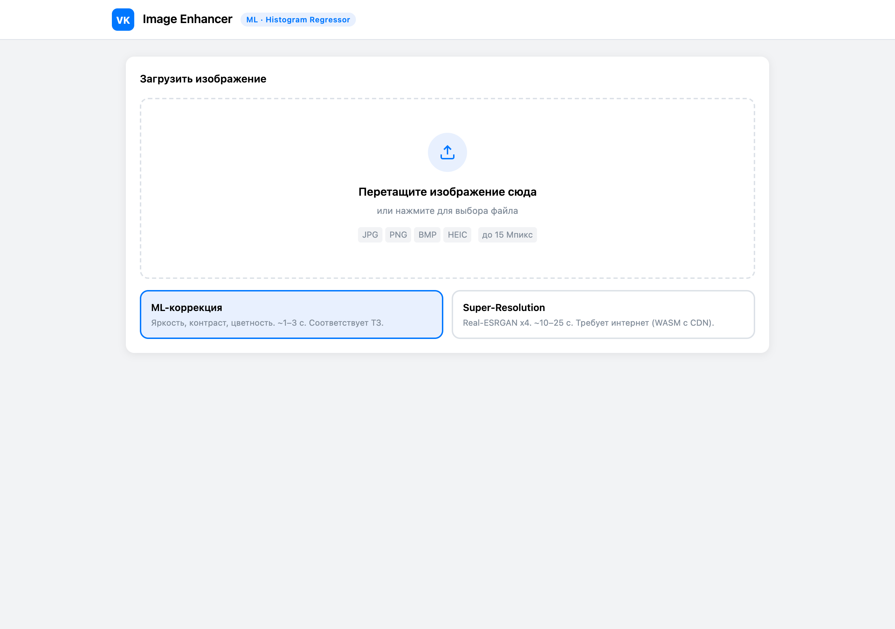
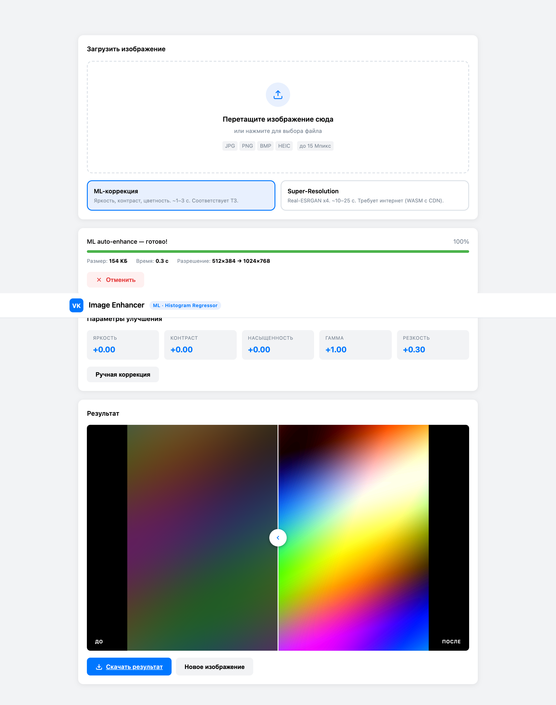

<div align="center">

# VK Image Enhancer

**ML-powered image enhancement that runs entirely in the browser.**
No backend. No uploads. Single HTML file + vendored ONNX Runtime.

[](https://github.com/napannich/vk-image-enhancer/actions/workflows/ci.yml)
[](https://napannich.github.io/vk-image-enhancer)
[](./LICENSE)
[](./scripts/check-bundle-size.mjs)
[](./tsconfig.json)

**Проект — VK Education Practice 2026 · ИТМО**
Задача №1113 «ML-модель для улучшения изображений»

[Live demo](https://napannich.github.io/vk-image-enhancer) · [Report](./docs/report.pdf) · [Presentation](./docs/presentation.pdf)

</div>

---

## Что это

Веб-приложение для автоматической коррекции изображений с помощью ML. Работает **полностью в браузере** — исходники не покидают устройство пользователя.

Два режима обработки:

| Режим | Что делает | Стек | Время | Соответствие ТЗ |
|---|---|---|---|---|
| **ML-коррекция** *(по умолчанию)* | Регрессор по гистограмме → яркость, контраст, насыщенность, гамма, резкость | Canvas API + Web Worker | 1–3 с | прямое соответствие |
| **Super-Resolution** *(опционально)* | Real-ESRGAN x4 — апскейл и восстановление деталей | ONNX Runtime Web (WASM) | 10–25 с | бонусная функциональность |

## Скриншоты

<table>
  <tr>
    <td width="50%"></td>
    <td width="50%"></td>
  </tr>
  <tr>
    <td align="center"><sub>Загрузка + выбор режима</sub></td>
    <td align="center"><sub>Сравнение до/после (слайдер-дивайдер)</sub></td>
  </tr>
</table>

## Соответствие ТЗ VK Education

| Требование | Реализовано |
|---|---|
| Работа в массовых современных браузерах | Chrome / Firefox / Safari / Edge (HEIC — Chrome 94+ и Safari) |
| Суммарный объём кода ≤ 10 МБ | **5.0 МБ** (проверяется в CI: `scripts/check-bundle-size.mjs`). WASM-рантайм ORT (~5 МБ) догружается с CDN только при включении SR-режима. |
| Обработка изображений до 15 Мпикс | Авто-даунскейл выше лимита, явное сообщение пользователю |
| Максимальное время обработки ≤ 30 с | Жёсткий timeout; задача отменяется, worker пересоздаётся |
| Среднее время обработки ≈ 5 с | 1–3 с в ML-режиме, 10–25 с в SR |
| Форматы: JPG, PNG, HEIC, BMP | Все четыре |
| Работа в асинхронном режиме | Web Worker + Transferable Objects (ArrayBuffer) |

### Соответствие рекомендованному API из ТЗ

| Рекомендация | Реализация |
|---|---|
| Метод постановки задачи | `window.enhancer.submitTask(file, options)` → `{ taskId }` |
| Метод получения статуса | `window.enhancer.getStatus(taskId)` → `{ status, progress }` |
| Метод прерывания задачи | `window.enhancer.cancelTask(taskId)` → `{ success }` |
| Метод получения готового изображения | `window.enhancer.getResult(taskId)` → `{ blob, url }` |
| Событие изменения статуса | `window.enhancer.on('statusChange', handler)` → `unsubscribe` |

## Использование

### Через UI (GitHub Pages)

Открыть [демо](https://napannich.github.io/vk-image-enhancer), перетащить файл — готово.

### Через публичный API

```javascript
// Постановка задачи
const { taskId } = await window.enhancer.submitTask(file, {
  mode: 'ml',              // 'ml' (по умолчанию) | 'sr' (Real-ESRGAN)
  outputFormat: 'image/jpeg',
  outputQuality: 0.92,
});

// Подписка на прогресс
const off = window.enhancer.on('statusChange', ({ status, progress, message }) => {
  console.log(`${status} · ${progress}% · ${message ?? ''}`);
});

// Получение результата
const poll = setInterval(() => {
  const { status } = window.enhancer.getStatus(taskId);
  if (status === 'done') {
    clearInterval(poll);
    off();
    const { blob, url } = window.enhancer.getResult(taskId);
    // blob — готовое изображение (JPEG/PNG), url — objectURL
  }
}, 200);
```

## Архитектура

```
┌────────────────────────────────────────────────────────────────────┐
│                       index.html (UI thread)                       │
│                                                                    │
│  ┌──────────────┐   ┌───────────────────┐   ┌──────────────────┐   │
│  │  Dropzone    │──▶│  TaskManager      │──▶│  window.enhancer │   │
│  │  (file input)│   │  (queue, events)  │   │  (public API)    │   │
│  └──────────────┘   └────────┬──────────┘   └──────────────────┘   │
└────────────────────────────┬─┴───────────────────────────────────── ┘
                             │ postMessage (Transferable)
                             ▼
┌────────────────────────────────────────────────────────────────────┐
│                Web Worker (Blob URL, inline code)                  │
│                                                                    │
│   ┌─────────────────────┐        ┌──────────────────────────┐     │
│   │  ImageAnalyzer      │        │  _superResolve()         │     │
│   │  • histogram        │        │  • importScripts(ort)    │     │
│   │  • auto-levels      │        │  • Real-ESRGAN x4 (ONNX) │     │
│   │  • param predictor  │        │  • tile-based inference  │     │
│   │  • Lanczos3 upscale │        │  • Padding 8 px          │     │
│   │  • unsharp mask     │        │                          │     │
│   └─────────┬───────────┘        └───────────┬──────────────┘     │
│             │ (ML mode, default)             │ (SR mode, opt-in)   │
│             └─────────────┬──────────────────┘                     │
└───────────────────────────┼─────────────────────────────────────── ┘
                            │ postMessage (result)
                            ▼
                     rendered into <canvas>
                     → JPEG/PNG encode → Blob
```

### Ключевые инженерные решения

- **Web Worker из Blob URL** — self-contained, работает с любого хостинга, один файл `index.html`.
- **Transferable Objects** (ArrayBuffer) — передача ImageData между UI и Worker без копирования.
- **Tile-based inference** (128×128 + 8 px padding) для Real-ESRGAN — чтобы не упираться в память на больших изображениях.
- **Auto-downscale до 768 px** перед SR: 4× апскейл возвращает картинку в исходный или больший размер, сохраняя 30-секундный бюджет.
- **30 с timeout** на задачу — жёсткий: worker пересоздаётся, задача переходит в `error`.
- **Без `eval`** — ONNX Runtime подгружается через `importScripts` (штатный API Web Worker), CSP-совместимо.

## Структура репозитория

```
.
├── index.html                — UI + inline Web Worker (self-contained)
├── src/
│   ├── analyzer.ts           — референсная реализация (тестируемая)
│   ├── canvas-utils.ts       — декодинг, ресайз, экспорт
│   ├── enhancer.ts           — типизированный TaskManager
│   ├── model.ts              — регрессор параметров
│   ├── worker.ts             — альтернативная сборка воркера
│   └── types.ts              — типы
├── tests/
│   └── analyzer.test.ts      — vitest unit-тесты (15 шт.)
├── vendor/                   — ORT Runtime 1.21.0 (ort.min.js; WASM-ран-тайм с CDN)
├── models/
│   └── realesrgan-x4.onnx    — Real-ESRGAN weights
├── docs/
│   ├── report.pdf            — отчёт по практике
│   ├── presentation.pdf      — презентация
│   ├── samples/              — эталонные изображения (underexposed, low-contrast, desaturated)
│   └── screenshots/          — скриншоты UI
├── scripts/
│   ├── check-bundle-size.mjs — guard для лимита 10 МБ
│   └── generate-samples.mjs  — детерминированная генерация эталонов
└── .github/workflows/ci.yml  — CI: build + tests + bundle-size
```

## Локальный запуск

```bash
git clone https://github.com/napannich/vk-image-enhancer.git
cd vk-image-enhancer
npm install

npm run dev         # dev-сервер на :3000, автооткрытие
npm test            # unit-тесты (vitest)
npm run build       # TypeScript → dist/
npm run check-size  # проверка бандла ≤ 10 МБ
npm run samples     # перегенерировать docs/samples/*.png
```

## Стек

- **TypeScript 5** · strict mode
- **ONNX Runtime Web 1.21.0** · WebAssembly, single-thread
- **Real-ESRGAN x4** · PyTorch → ONNX
- **Canvas API** · `OffscreenCanvas`, `createImageBitmap`, `ImageBitmap`
- **Web Workers** · Blob-URL, Transferable Objects
- **Vitest 2** · happy-dom

## Автор

**Напалков Андрей** · Университет ИТМО, магистратура
VK Education Practice 2026 · группа Уч_П95-11

Руководитель практики: Фёдоров Д.А. (ИТМО)

## Лицензия

[MIT](./LICENSE)
